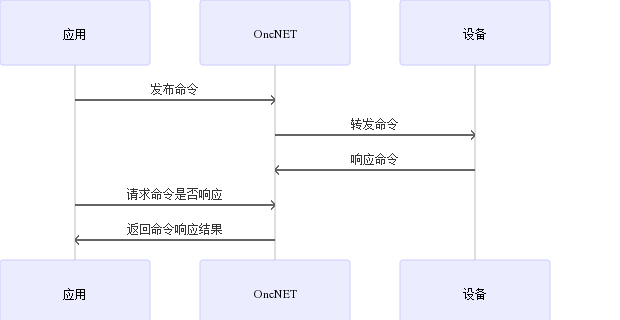
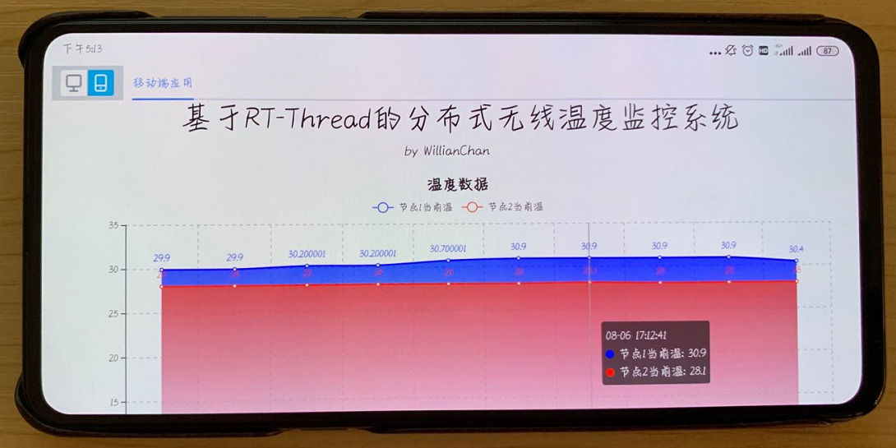

# 智能家居 DIY 教程连载（4）

> 云是万物互联之本

Hi，各位小伙伴，DIY 活动已经来到了尾声，第四周的任务完成之后，也就意味着整个项目就完全做完啦，是不是迫不及待先把整个 DIY 做出来打造一个属于自己的智能家居温度监控系统呢？那就赶紧来看看最后的任务是如何完成的吧~

## 本文目录

- 1. 第四周任务概览
- 2. 准备工作
- 3. 
- 3. 开源代码
- 4. 结果展示
- 5. 注意事项

## 1. 第四周任务概览

我们来回顾一下第四周的任务：

- ~~接收节点根据上位机数据帧格式，通过串口发送温度数据给上位机，上位机能正确显示温度曲线~~
- 了解 RT-Thread 的 OneNet 云软件包、AT 组件，并使用它们实现将接收节点的数据通过 esp8266 wifi 模块上传至 OneNet 云端，云端要求能简单制作小应用实现实时温度远程监控

这一周的任务重点是对接云，云是物联网中必不可少的一个重要部分，与物联网有着密切的关联。本篇教程将给大家讲解一下如何通过 esp8266 wifi 模块将温度数据上传到 OneNet 云，实现远程监控温度。

本篇文章取消了对上位机使用的讲解，因为上位机的使用过于简单，大家私底下自行尝试即可。上位机的使用方法及其源码：[点此处跳转](https://github.com/willianchanlovegithub/Upper_computer_of_Multi-point_temperature_monitoring_system)。

## 2. 准备工作

**请务必先学习以下内容，再继续看本篇文章：**

- OneNet 的产品创建与设备接入视频教程：[点此处跳转](https://www.rt-thread.org/document/site/tutorial/qemu-network/onenet/onenet/)
- OneNet 软件包简介与使用方法：[点此处跳转](https://github.com/RT-Thread-packages/onenet)

以上内容是十分重要的预备知识，不要偷懒略过上述内容的学习噢。

## 3. OneNet 云软件包工作原理

OneNet 软件包数据的上传和命令的接收是基于 MQTT 实现的，OneNet  的初始化其实就是 MQTT 客户端的初始化，初始化完成后，MQTT 客户端会自动连接 OneNet 平台。数据的上传其实就是往特定的 topic 发布消息。当服务器有命令或者响应需要下发时，会将消息推送给设备。

获取数据流、数据点，发布命令则是基于 HTTP Client 实现的，通过 POST 或 GET 将相应的请求发送给 OneNet 平台，OneNet 将对应的数据返回，这样，我们	就能在网页上或者手机 APP 上看到设备上传的数据了。

下图是应用显示设备上传数据的流程图：


下图是应用下发命令给设备的流程图：



## 3. 开源代码

为了更进一步便于大家学习，第四周任务的代码已经开源啦~ [请点击这里查看](https://github.com/willianchanlovegithub/DIY_projects_base_on_RT-Thread)

## 4. 结果展示

- 在网页上查看 OneNet 云端数据，能正常收到来自每个发送节点数据流了： 


- OneNet PC端应用，可在电脑实现远程监控：


- OneNet 移动端应用，可在手机平板等设备实现远程监控：



- 本地 FinSH 信息输出，提示mqtt初始化成功和数据上传 OneNet 服务器成功：


## 5. 注意事项

- 第四周的 demo 工程中只接收两个发送节点的数据，需要更多发送节点的可以自行添加。
- 第四周的 demo 工程的文件系统是挂载在 SD Card 上的，需要挂载在 SPI Flash 上的请自行参考第三周的 SPI Flash 的 demo 工程。
- 发送节点的程序下载第二周中的 demo 就好了，GitHub 中的 `Fourth week mission` 文件夹不再包含发送节点工程。
- 移动端要远程监控温度需要在 OneNet 官网下载一个叫设备云的 APP，如下图，点击此[链接](https://open.iot.10086.cn/doc/art656.html#118)跳转至官网下载页面：


[AT学习](https://www.rt-thread.org/document/site/programming-manual/at/at/)

开启 esp8266:

```
RT-Thread online packages  --->
  IoT - internet of things  --->
    [*] AT DEVICE: RT-Thread AT component porting or samples for different device  --->
      [*]   Espressif ESP8266  --->
        (testwifi) WIFI ssid
        (12345678) WIFI password
```