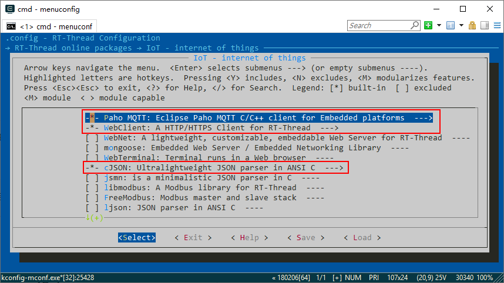
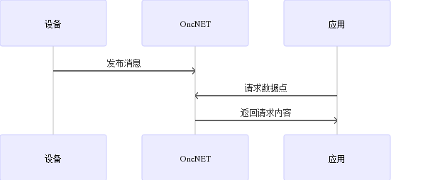
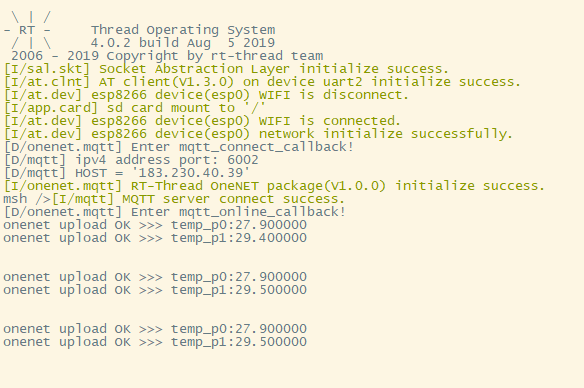
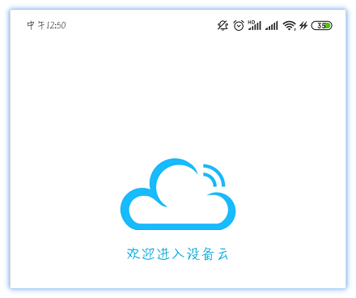

# 智能家居 DIY 教程连载（4）

> 云乃万物互联之本

Hi，各位小伙伴，DIY 活动已经来到了尾声，第四周的任务是整个项目中最有趣也是最重要的部分——物联网。本周的任务完成之后，也就意味着整个项目就完全做完啦，是不是迫不及待先把整个 DIY 做出来打造一个属于自己的智能家居温度监控系统呢？那就赶紧来看看最后的任务是如何完成的吧~

## 本文目录

- 1. 第四周任务概览
- 2. 准备工作
- 3. 配置工程
- 4. 开发思路
- 5. OneNet 应用开发
- 6. 开源代码
- 7. 结果展示
- 8. 注意事项

## 1. 第四周任务概览

我们来回顾一下第四周的任务：

- ~~接收节点根据上位机数据帧格式，通过串口发送温度数据给上位机，上位机能正确显示温度曲线~~
- 了解 RT-Thread 的 OneNet 云软件包、AT 组件，并使用它们实现将接收节点的数据通过 esp8266 wifi 模块上传至 OneNet 云端，云端要求能简单制作小应用实现实时温度远程监控

这一周的任务重点是对接云，云是物联网中必不可少的一个重要部分，与物联网有着密切的关联。本篇教程将给大家讲解一下如何通过 esp8266 wifi 模块将温度数据上传到 OneNet 云，实现远程监控温度。

本篇文章取消了对上位机使用的讲解，因为上位机的使用过于简单，大家私底下自行尝试即可。上位机的使用方法及其源码：[点此处跳转](https://github.com/willianchanlovegithub/Upper_computer_of_Multi-point_temperature_monitoring_system)。

## 2. 准备工作

**请务必先学习以下内容，再继续看本篇文章：**

- OneNet 的产品创建与设备接入视频教程：[点此处跳转](https://www.rt-thread.org/document/site/tutorial/qemu-network/onenet/onenet/)
- OneNet 软件包简介与使用说明：[点此处跳转](https://github.com/RT-Thread-packages/onenet)
- AT Device 软件包简介与使用说明：[点此处跳转](https://github.com/RT-Thread-packages/at_device)
- 《RT-Thread 编程指南》中 AT 组件的章节 ：[点此处跳转](https://www.rt-thread.org/document/site/programming-manual/at/at/)
- Paho MQTT 软件包简介与使用说明：[点此处跳转](https://github.com/RT-Thread-packages/paho-mqtt)

以上内容是十分重要的预备知识，不要偷懒略过上述内容的学习噢。

## 3. 配置工程

首先，要想清楚第四周的整个工程需要依赖什么工具才能正常工作，简单来说，我们需要将 ESP8266 对接到 OneNet 云，而 ESP8266 通过 AT Device 控制的，所以现在目标是明确的：开启 AT 和 ESP8266，并配置 OneNet 软件包中的相关参数。

开启 AT 和 ESP8266，ESP8266 的 WIFI 账号和密码需要写对，不然连不上网，自然就对接不上 OneNet 了：

```
RT-Thread online packages  --->
  IoT - internet of things  --->
    [*] AT DEVICE: RT-Thread AT component porting or samples for different device  --->
      [*]   Espressif ESP8266  --->
        (testwifi) WIFI ssid
        (12345678) WIFI password
        (uart2) AT client device name
        (512)   The maximum length of receive line buffer
```

开启 OneNet，完成相关参数配置，其中 `device id`、`auth info`、`api key`、`product id`、`master/product apikey` 这些参数如何配置请查看 OneNet 的产品创建与设备接入视频教程：[点此处跳转](https://www.rt-thread.org/document/site/tutorial/qemu-network/onenet/onenet/)

```
RT-Thread online packages  --->
    IoT - internet of things  --->
        IoT Cloud  --->
            [*] OneNET: China Mobile OneNet cloud SDK for RT-Thread  --->
                [ ]   Enable OneNET sample
                [*]   Enable support MQTT protocol
                [ ]   Enable OneNET automatic register device
                (534342011) device id
                (201907091115) auth info
                (IFzqRGOjq530YSyFY6EMda45Xdw=) api key
                (258302) product id
                (FV=ssEvYvHcKqN0=ZdTjM6NrGv0=) master/product apikey
```

值得一提的是，OneNet 软件包是需要依赖 paho-mqtt、webclient、cJSON 的，选中 OneNet 后，以上三个选项也会被自动选中，如下图：



注意自己手上的 ESP8266 接板子的哪个串口，需要将这个串口打开：

```
Hardware Drivers Config  --->
    On-chip Peripheral Drivers  --->
        [*] Enable UART  --->
            [*] Enable UARTx
```

在 menuconfig 中完成以上配置之后，先 `pkgs --update` 将软件包获取到本地，再 `scons --target=mdk5` 更新工程，将相关软件包加载到工程中来。

## 4. 开发思路

### 4.1 OneNet 软件包工作原理

首先，我们需要大致了解一下 OneNet 软件包的工作原理。

OneNet 软件包数据的上传和命令的接收是基于 MQTT 实现的，OneNet  的初始化其实就是 MQTT 客户端的初始化，初始化完成后，MQTT 客户端会自动连接 OneNet 平台。数据的上传其实就是往特定的 topic 发布消息。当服务器有命令或者响应需要下发时，会将消息推送给设备。

获取数据流、数据点，发布命令则是基于 HTTP Client 实现的，通过 POST 或 GET 将相应的请求发送给 OneNet 平台，OneNet 将对应的数据返回，这样，我们	就能在网页上或者手机 APP 上看到设备上传的数据了。

下图是应用显示设备上传数据的流程图：



下图是应用下发命令给设备的流程图：


### 4.2 MQTT 初始化

了解了 OneNet 软件包的工作原理后，我们知道，OneNet 软件包数据的上传和命令的接收是基于 MQTT 实现的，OneNet  的初始化其实就是 MQTT 客户端的初始化。OneNet 软件包提供了一个接口 `onenet_mqtt_init`，供用户去初始化 MQTT，只有当 MQTT 初始化成功之后，才能做后续的操作，如上传数据到 OneNet 服务器。

我们创建两个线程去工作，`onenet_mqtt_init_thread` 线程用于初始化 MQTT 客户端，`onenet_upload_data_thread` 线程去上传数据给云。那么问题来了，`onenet_upload_data_thread` 线程怎么知道 MQTT 初始化成功了呢？这里使用信号量去通知。

要用信号量之前，第一步当然是创建一个信号量：

```.c
mqttinit_sem = rt_sem_create("mqtt_sem", RT_NULL, RT_IPC_FLAG_FIFO);
```

在 `onenet_mqtt_init_thread` 线程的线程入口函数中使用 OneNet 软件包提供的接口 `onenet_mqtt_init` 去初始化 MQTT，初始化成功后，释放信号量：

```.c
static void onenet_mqtt_init_entry(void *parameter)
{
    uint8_t onenet_mqtt_init_failed_times;
    
    /* mqtt初始化 */
    while (onenet_mqtt_init())
    {
        rt_thread_mdelay(100);
        LOG_E("onenet mqtt init failed %d times", onenet_mqtt_init_failed_times++);
    }
    /* mqtt初始化成功之后，释放信号量告知onenet_upload_data_thread线程可以上传数据了 */
    rt_sem_release(mqttinit_sem);
}
```

`onenet_upload_data_thread` 线程要一直等待信号量的到来，才能上传数据，看看它的线程入口函数的伪代码：

```.c
static void onenet_upload_data_entry(void *parameter)
{
    /* 永久等待方式接收信号量，若收不到，该线程会一直挂起 */
    rt_sem_take(mqttinit_sem, RT_WAITING_FOREVER);
    /* 后面用不到这个信号量了，把它删除了，回收资源 */
    rt_sem_delete(mqttinit_sem);
    
    while (1)
    {
        /* 这里是上传数据到OneNet的代码*/
        /* 这里要怎么写，后面会有教程说明 */
    }
}
```

在上面的代码中，其实不用信号量也能完成上述工作。这里创建两个线程，并且使用信号量去做通知工作，旨在能让大家多学习些 IPC 的使用。

### 4.3 上传数据至云端

在 ESP8266 已经正常连上 WIFI 的前提下，MQTT 初始化成功后，就可以放心大胆的上传数据给 OneNet 了。OneNet 软件包给用户提供了几个上传数据的接口，详情请查看 OneNet 软件包的 API 说明文档：[点此处跳转](https://github.com/RT-Thread-packages/onenet/blob/master/docs/api.md)。这个 DIY 项目中需要上传的数据是温度数据，属于数字数据，可以使用下面这个 API：

```.c
rt_err_t onenet_mqtt_upload_digit(const char *ds_name, const double digit);
```

利用 mqtt 向 OneNET 平台发送字符串数据。

| **参数** | **描述**       |
| -------- | -------------- |
| ds_name  | 数据流名称     |
| str      | 要上传的字符串 |
| **返回** | **--**         |
| 0        | 上传成功       |
| -5       | 内存不足       |

根据前两周的教程，我们知道 `nrf24l01_thread` 线程是用来通过 nrf24l01 射频模块接收发送节点采集到的温度数据的。那么如何将 `nrf24l01_thread` 线程收到的温度数据给 `onenet_upload_data_thread` 线程上传云呢？这里使用邮箱和内存池来实现。邮箱和内存池的使用，可以回顾一下第二周的教程：[点此处跳转](https://github.com/willianchanlovegithub/DIY_projects_base_on_RT-Thread/tree/master/DIY1/Second_week_mission)。

使用邮箱和内存池是为了解决一下问题：

- `nrf24l01_thread` 线程接收数据过快，`onenet_upload_data_thread` 线程来不及上传。
- `onenet_upload_data_thread` 线程上传过快，`nrf24l01_thread` 线程来不及接收数据。

其实就是典型的流控问题，或者说是供求关系问题。

在 `onenet_upload_data_thread` 线程入口函数中利用 `onenet_mqtt_upload_digit` 上传数据给 OneNet：

```.c
static void onenet_upload_data_entry(void *parameter)
{
    struct recvdata *buf_mp;
    
    /* 永久等待方式接收信号量，若收不到，该线程会一直挂起 */
    rt_sem_take(mqttinit_sem, RT_WAITING_FOREVER);
    /* 后面用不到这个信号量了，把它删除了，回收资源 */
    rt_sem_delete(mqttinit_sem);
    
    while (1)
    {
        if (rt_mb_recv(tmp_msg_mb, (rt_ubase_t*)&buf_mp, RT_WAITING_FOREVER) == RT_EOK)
        {
            /* 500ms上传一次数据 */
            rt_thread_delay(rt_tick_from_millisecond(500));
            /* 上传发送节点1的数据到OneNet服务器，数据流名字是temperature_p0 */
            if (onenet_mqtt_upload_digit("temperature_p0", buf_mp->temperature_p0) != RT_EOK)
                rt_kprintf("upload temperature_p0 has an error, try again\n");
            else
                printf("onenet upload OK >>> temp_p0:%f\n", buf_mp->temperature_p0);
            
            rt_mp_free(buf_mp); /* 释放内存块 */
            buf_mp = RT_NULL;   /* 请务必要做 */
        }
    }
}
```

就是这么简单。

如果说，我们底下有多个发送节点采集温度，接收节点会收到多个发送节点的温度数据，而只有 一个 ESP8266，怎么在上传数据给 OneNet 的时候区分这些不同节点的数据？这里其实只需要建立不同的数据流就好了，每一个节点的数据为一个数据流，`rt_err_t onenet_mqtt_upload_digit(const char *ds_name, const double digit)` 函数的第一个参数就是数据流的名称，起不同名字就是不用的数据流了，如：

```.c
/* 上传发送节点1的数据到OneNet服务器，数据流名字是temperature_p0 */
onenet_mqtt_upload_digit("temperature_p0", buf_mp->temperature_p0);
/* 上传发送节点2的数据到OneNet服务器，数据流名字是temperature_p1 */
onenet_mqtt_upload_digit("temperature_p1", buf_mp->temperature_p1);
```


## 5. OneNet 应用开发

我们关把数据上传给 OneNet 后，如何才能看到这些数据呢？OneNet 给开发者提供了一些简单应用开发的工具，我们利用这些工具在 OneNet 上创建一些简单的小应用，即可实现对数据的远程监控了。


由于文章篇幅有限，这里就不详细展示如何制作应用了，更多内容，请查看 OneNet 的产品创建与设备接入视频教程：[点此处跳转](https://www.rt-thread.org/document/site/tutorial/qemu-network/onenet/onenet/)。

## 6. 开源代码

为了更进一步便于大家学习，第四周任务的代码已经开源啦~ [请点击这里查看](https://github.com/willianchanlovegithub/DIY_projects_base_on_RT-Thread)。请给这个项目点个小星星(Star)^_^

获得更多官方技术支持，请添加 RT-Thread 小师妹为好友，备注`智能家居 DIY`，可拉进技术交流群。微信扫下方二维码添加好友：


## 7. 结果展示

- 在网页上查看 OneNet 云端数据，能正常收到来自每个发送节点数据流了： 


- OneNet PC端应用，可在电脑实现远程监控。（如：人坐在办公室，查看家里房间客厅的温度，看看家里着火没有）：


- OneNet 移动端应用，可在手机平板等设备实现远程监控。（如：外出旅游，打开手机 APP，查看办公室的温度，看看办公室着火没）


- 本地 FinSH 信息输出，提示 mqtt 初始化成功、ESP8266 连接 WIFI 成功、数据上传 OneNet 服务器成功：



## 8. 注意事项

- 第四周的 demo 工程只接收两个发送节点的数据，需要更多发送节点的可以自行添加。
- 第四周的 demo 工程中的 `RECEIVE(stm32l475-atk-pandora)(SD_Card)(ESP8266)` 是利用 ESP8266 对接 OneNet 的，使用 SD Card 挂载文件系统。
- 第四周的 demo 工程中的 `RECEIVE(stm32l475-atk-pandora)(SPI Flash)(RW007)` 是利用 RW007 对接 OneNet 的，使用 SPI Flash 挂载文件系统，RW007 的配置与 ESP8266 一样，请参考上面教程。
- 发送节点的程序下载第二周中的 demo 就好了，GitHub 中的 `Fourth week mission` 文件夹不再包含发送节点工程。
- 移动端要远程监控温度需要在 OneNet 官网下载一个叫设备云的 APP，如下图，点击此[链接](https://open.iot.10086.cn/doc/art656.html#118)跳转至官网下载页面：



